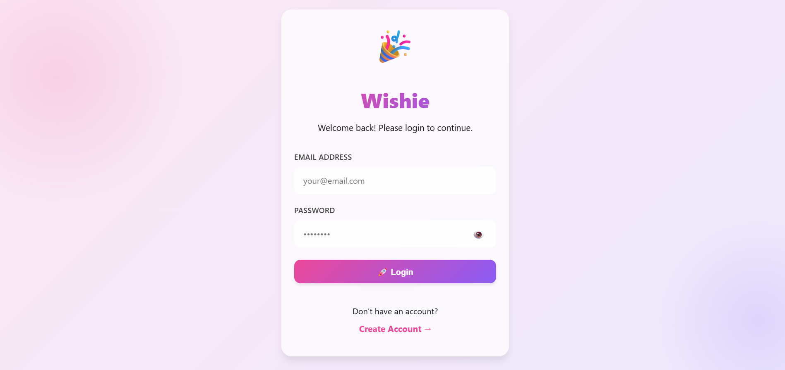
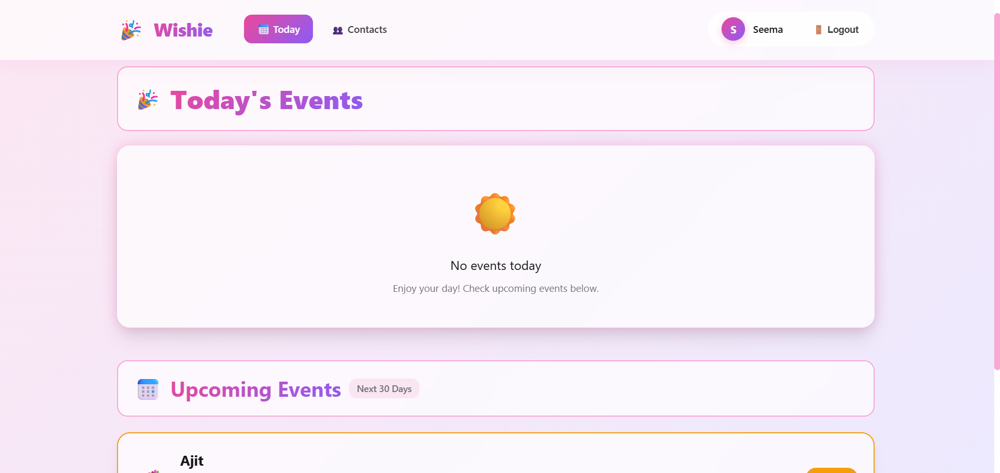
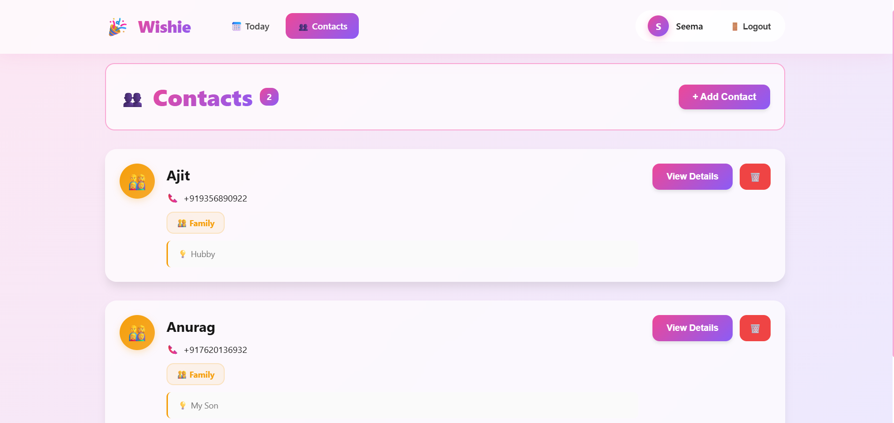
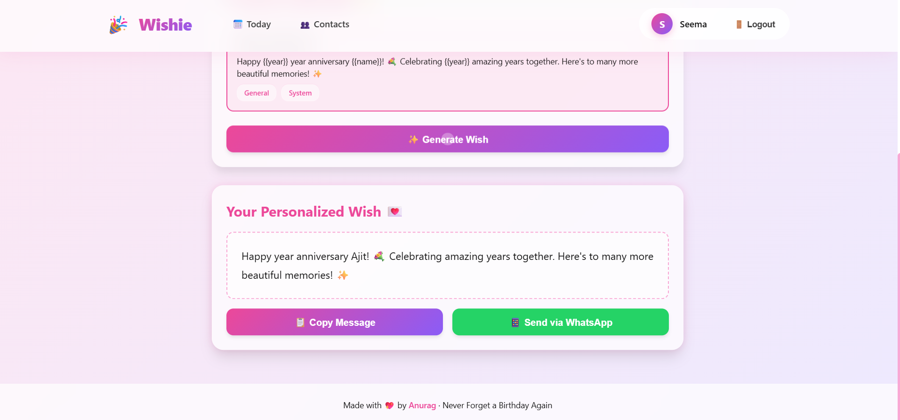

# 🎉 Wishie - Never Forget A Moment That Matters!!

A beautiful, full-stack Progressive Web App (PWA) for managing contacts, tracking birthdays/anniversaries, and sending personalized wishes via WhatsApp.

## 🌐 Live Demo

**👉 [Try Wishie Live](https://wishie-frontend.vercel.app/)**


---


---

## ✨ Features

### 🔐 Authentication
- Secure JWT-based authentication with access & refresh tokens
- Password validation with bcrypt hashing
- Persistent sessions with HTTP-only cookies

### 👥 Contact Management
- Add, edit, and delete contacts with phone numbers
- Categorize by relationship (Family, Friend, Colleague, etc.)
- Color-coded avatars by relation type
- Add notes for gift preferences

### 🎂 Smart Event Tracking
- Automatic next occurrence calculation
- Handles birthdays, anniversaries, pet birthdays
- Leap year support (Feb 29)
- "Today" and "Upcoming 30 Days" views
- Visual countdown badges

### 💌 Wish Generator
- 12+ pre-made templates by category
- Personalized variable replacement ({{name}}, {{age}}, {{year}})
- Copy to clipboard functionality
- Direct WhatsApp integration with pre-filled messages

### 🎨 Beautiful UI/UX
- Glass morphism design system
- Pink gradient theme with smooth animations
- Responsive mobile-first layout
- Hover effects and micro-interactions
- PWA-ready with offline support

---

## 🛠️ Tech Stack

### Backend
- **Runtime:** Node.js
- **Framework:** Express.js
- **Database:** MongoDB Atlas
- **Authentication:** JWT (jsonwebtoken)
- **Password Hashing:** bcryptjs
- **Validation:** express-validator

### Frontend
- **Framework:** React 18
- **Build Tool:** Vite
- **Routing:** React Router v6
- **HTTP Client:** Axios
- **PWA:** vite-plugin-pwa

### DevOps
- **Backend Hosting:** Render
- **Frontend Hosting:** Vercel
- **Database:** MongoDB Atlas (Cloud)
- **Version Control:** Git & GitHub

---

## 📁 Project Structure

```
wishie/
├── backend/
│   ├── config/
│   │   └── db.js
│   ├── controllers/
│   │   ├── authController.js
│   │   ├── contactController.js
│   │   ├── eventController.js
│   │   ├── templateController.js
│   │   └── wishController.js
│   ├── middleware/
│   │   └── auth.js
│   ├── models/
│   │   ├── User.js
│   │   ├── Contact.js
│   │   ├── Event.js
│   │   └── Template.js
│   ├── routes/
│   │   ├── authRoutes.js
│   │   ├── contactRoutes.js
│   │   ├── eventRoutes.js
│   │   ├── templateRoutes.js
│   │   └── wishRoutes.js
│   ├── seed/
│   │   ├── templates.json
│   │   └── seedTemplates.js
│   ├── services/
│   │   └── templateService.js
│   ├── utils/
│   │   ├── dateUtils.js
│   │   └── validators.js
│   ├── .env
│   ├── package.json
│   └── server.js
│
├── frontend/
│   ├── src/
│   │   ├── api/
│   │   │   └── axios.js
│   │   ├── components/
│   │   │   ├── Layout.jsx
│   │   │   └── ProtectedRoute.jsx
│   │   ├── contexts/
│   │   │   └── AuthContext.jsx
│   │   ├── pages/
│   │   │   ├── Login.jsx
│   │   │   ├── Register.jsx
│   │   │   ├── Today.jsx
│   │   │   ├── Contacts.jsx
│   │   │   ├── ContactDetail.jsx
│   │   │   ├── CreateEvent.jsx
│   │   │   └── WishGenerator.jsx
│   │   ├── App.jsx
│   │   ├── main.jsx
│   │   └── index.css
│   ├── .env
│   ├── package.json
│   └── vite.config.js
│
└── README.md
```

---

## 🚀 Quick Start

### Prerequisites
- Node.js (v18+)
- MongoDB Atlas account
- Git

### 1. Clone Repository

git clone https://github.com/4nxrag/wishie.git
cd wishie

### 2. Setup Backend

cd backend
npm install

Create .env file
cat > .env << EOF
NODE_ENV=development
PORT=5000
MONGODB_URI=your_mongodb_connection_string
JWT_ACCESS_SECRET=your_super_secret_key_minimum_32_characters
JWT_REFRESH_SECRET=your_refresh_secret_key_minimum_32_characters
JWT_ACCESS_EXPIRY=15m
JWT_REFRESH_EXPIRY=7d
CORS_ORIGIN=http://localhost:5173
EOF

Seed templates
npm run seed

Start development server
npm run dev

### 3. Setup Frontend

cd ../frontend
npm install

Create .env file
echo "VITE_API_URL=http://localhost:5000/api" > .env

Start development server
npm run dev


### 4. Open Application
- Frontend: http://localhost:5173
- Backend: http://localhost:5000/health

---

## 🗄️ Database Schema

### Users

{
name: String,
email: String (unique),
password: String (hashed),
createdAt: Date,
updatedAt: Date
}

### Contacts

{
userId: ObjectId (ref: User),
name: String,
phone: String,
relation: String (girlfriend/boyfriend/friend/family/colleague/other),
notes: String,
createdAt: Date,
updatedAt: Date
}

### Events

{
userId: ObjectId (ref: User),
contactId: ObjectId (ref: Contact),
title: String,
type: String (birthday/anniversary/pet_birthday/other),
originalDate: Date,
recurringMonth: Number,
recurringDay: Number,
nextOccurrence: Date (auto-calculated),
notes: String,
createdAt: Date,
updatedAt: Date
}

### Templates

{
title: String,
content: String (with {{variables}}),
category: String,
eventType: String,
isSystem: Boolean,
userId: ObjectId,
createdAt: Date,
updatedAt: Date
}


---

## 📡 API Endpoints

### Authentication
- `POST /api/auth/register` - Create account
- `POST /api/auth/login` - Login
- `POST /api/auth/refresh` - Refresh access token
- `POST /api/auth/logout` - Logout
- `GET /api/auth/me` - Get current user

### Contacts
- `GET /api/contacts` - Get all contacts
- `GET /api/contacts/:id` - Get single contact
- `POST /api/contacts` - Create contact
- `PUT /api/contacts/:id` - Update contact
- `DELETE /api/contacts/:id` - Delete contact

### Events
- `GET /api/events` - Get all events
- `GET /api/events/today` - Get today's events
- `GET /api/events/upcoming` - Get next 30 days
- `POST /api/events` - Create event
- `PUT /api/events/:id` - Update event
- `DELETE /api/events/:id` - Delete event

### Templates
- `GET /api/templates` - Get all templates
- `POST /api/templates` - Create custom template
- `DELETE /api/templates/:id` - Delete custom template

### Wishes
- `POST /api/wishes/generate` - Generate personalized wish

---

## 🎨 Design System

### Colors
- **Primary:** #ec4899 (Pink)
- **Primary Dark:** #db2777
- **Primary Light:** #f9a8d4
- **Accent:** #f472b6

### Gradients
- **Primary Gradient:** linear-gradient(135deg, #ec4899 0%, #8b5cf6 100%)
- **Light Gradient:** linear-gradient(135deg, #fce7f3 0%, #ede9fe 100%)

### Effects
- **Glass Morphism:** backdrop-filter: blur(10px)
- **Shadows:** Multiple elevation levels with glow effects
- **Transitions:** cubic-bezier(0.4, 0, 0.2, 1)

---

## 🌐 Deployment

### Backend (Render)
1. Create Render account
2. Connect GitHub repository
3. Set environment variables
4. Deploy from `backend` folder

### Frontend (Vercel)
1. Create Vercel account
2. Import GitHub repository
3. Set build settings (Vite)
4. Add `VITE_API_URL` environment variable
5. Deploy

### Environment Variables

**Backend (.env)**

NODE_ENV=production
PORT=5000
MONGODB_URI=mongodb+srv://...
JWT_ACCESS_SECRET=your_secret
JWT_REFRESH_SECRET=your_refresh_secret
JWT_ACCESS_EXPIRY=15m
JWT_REFRESH_EXPIRY=7d
CORS_ORIGIN=https://your-frontend.vercel.app

**Frontend (.env.production)**

VITE_API_URL=https://backend.render.app/api


---

## 🧪 Testing

### Manual Testing
- ✅ User registration/login
- ✅ Contact CRUD operations
- ✅ Event CRUD operations
- ✅ Date calculations (leap years)
- ✅ Template rendering
- ✅ Wish generation
- ✅ WhatsApp integration
- ✅ Responsive design

---

## 🐛 Known Issues & Solutions

### Issue: Status 0 on Login
**Solution:** Check CORS configuration and ensure backend is running

### Issue: Events not showing in "Today"
**Solution:** Verify timezone handling in Event model pre-save hook

### Issue: HTML entities in names (&#x27;)
**Solution:** Decode HTML entities using helper function

---

## 🚧 Roadmap

- [ ] Email notifications (Nodemailer + Cron)
- [ ] Push notifications (PWA)
- [ ] Bulk import contacts (CSV)
- [ ] Search & filter functionality
- [ ] Analytics dashboard
- [ ] Multi-language support (i18n)
- [ ] Dark mode toggle
- [ ] Custom WhatsApp templates
- [ ] Social media sharing

---

## 🤝 Contributing

Contributions are welcome! Please follow these steps:

1. Fork the repository
2. Create feature branch (`git checkout -b feature/AmazingFeature`)
3. Commit changes (`git commit -m 'Add AmazingFeature'`)
4. Push to branch (`git push origin feature/AmazingFeature`)
5. Open Pull Request

---

## 📄 License

This project is licensed under the MIT License - see the [LICENSE](LICENSE) file for details.

---

## 👨‍💻 Author

**Anurag**
- GitHub: [@4nxrag](https://github.com/4nxrag)
- LinkedIn: [@4nxrag](https://www.linkedin.com/in/4nxrag/)

---

## 🙏 Acknowledgments

- MongoDB Atlas for cloud database hosting
- Railway for backend hosting
- Vercel for frontend hosting
- React community for amazing tools
- All open-source contributors

---

## 📸 Screenshots

### Login Page


### Today's Events


### Contacts List


### Wish Generator


---

## 💬 Support

For support, email anuuragjha70@gmail.com or open an issue on GitHub.

---

<div align="center">

**Built with ❤️ using MERN Stack**

⭐ Star this repo if you found it helpful!

</div>
